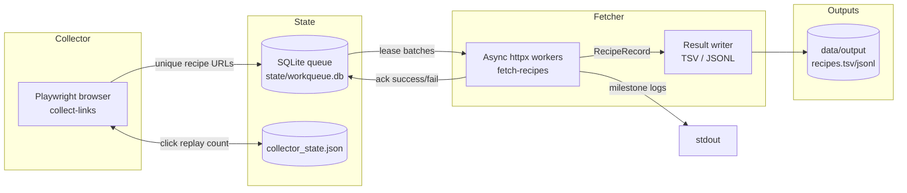

## System Design

The scraper is architected as two independent workers that communicate only through a persistent queue. This separation keeps the browser session lightweight while the fetcher scales aggressively with async HTTP.

### Component Breakdown

**Link Collector (`src/workers/link_collector.py`)**
- Headless Chromium via Playwright.
- Knows how to click “Показать ещё результаты…” with adaptive waits (`results_wait_timeout`) so it only advances once new cards appear.
- Tracks progress with `CollectorState` (JSON). On restart it replays the exact number of prior clicks before continuing.
- Emits milestones every N newly added unique URLs (default 2 000 in Docker).
- Fallback `--mode http` iterates the AJAX pagination endpoint when browsers misbehave in CI/Docker.

**Persistent Queue (`src/storage/link_store.py`)**
- SQLite table `urls(url TEXT PRIMARY KEY, status TEXT, ...)`.
- `add_links()` inserts truly new URLs; re-adding an existing but unprocessed URL just resets its status without incrementing milestone counts.
- WAL is preferred; Docker can disable it via `SCRAPER_DISABLE_WAL=1` for macOS volume compatibility.
- Queue state plus link milestones survive crashes because operations are transactional.

**Recipe Fetcher (`src/workers/recipe_fetcher.py`)**
- Leases batches (`batch_size`) and fans out HTTP work with `httpx.AsyncClient` constrained by `http_concurrency`.
- Parses HTML using `selectolax` (`src/parsers/recipe_parser.py`), stripping scripts/ads and normalizing nutrition info.
- Logs every `progress_interval` recipes (default 200) at WARNING so production logs stay concise.
- Retries failures up to `max_failures` before moving them to the `failed` bucket.

**Result Writer (`src/core/writer.py`)**
- Writes TSV and optional JSONL in lock-step; headers emitted once per run.
- Relies on the queue’s uniqueness guarantee, so duplicate payloads are still written but deduped via the upstream primary key.
- Records include metadata (`captured_at`, nutrition, GI, weights) for analytics pipelines.

### Data Flow Detail
1. **Seed / Resume** – Collector loads search page, optionally replays `state.clicks_completed`.
2. **Load-more loop** – It clicks the button, waits for DOM growth, extracts normalized recipe URLs via `CARD_SELECTORS`, and pushes them into the queue.
3. **Queue management** – `LinkStore` timestamps entries, leases batches FIFO, and handles ack/fail transitions.
4. **Fetch & parse** – Fetcher downloads HTML, runs `parse_recipe()`, enriches instructions/ingredients, and collects nutrition stats.
5. **Write & ack** – Successful parses flush to disk in `flush_size` chunks; URLs are marked `processed`. Failures are retried with exponential backoff metadata.

### Configuration Surfaces

| Area | Important knobs | Notes |
| --- | --- | --- |
| Collector | `--click-delay`, `--scroll-pause`, `--results-wait-timeout`, `--max-clicks`, `--mode` | Smaller delays speed up discovery but risk bans; timeouts keep DOM polling reliable. |
| Fetcher | `--batch-size`, `--http-concurrency`, `--flush-size`, `--progress-interval`, `--max-failures` | Tune for desired throughput vs. site politeness. |
| Paths | `--state-dir`, `--output-file`, `--jsonl-file`, `SCRAPER_BASE_URL`, `SCRAPER_SEARCH_PATH` | All paths default to `state/` and `data/output`. |
| Logging | `LOG_LEVEL`, `SCRAPER_PROGRESS_INTERVAL` | Compose sets `WARNING` plus large progress intervals for stable operations. |

Env vars mirror CLI flags (see `CollectorSettings`/`FetcherSettings` in `src/core/config.py`).

### Durability & Observability
- **State volume** – Docker Compose mounts `state-data:/app/state`, ensuring the queue survives container restarts.
- **Milestones** – Collector increments only when `LinkStore.add_links` reports new uniques; fetcher milestones track successfully parsed recipes.
- **Cleaning runs** – Remove `data/output` and `state/collector_state.json`, then drop the volume (`docker compose down -v`) before redeploying.
- **Benchmarking** – `scripts/benchmark_delays.py` brute-forces `click_delay` / `scroll_pause` combos against a disposable state directory to find safe yet fast values.

### Extension Ideas
- Add Prometheus/JSON telemetry for queue depth and throughput.
- Create a lightweight health endpoint exposing processed counts.
- Support automated error triage (e.g., capturing HTML for repeated parser failures).
- Expand HTTP-only collector mode to follow multiple search paths.

Refer back to the root `README.md` for deployment instructions; use this document when you need to understand how the system behaves under the hood or when planning architectural changes.