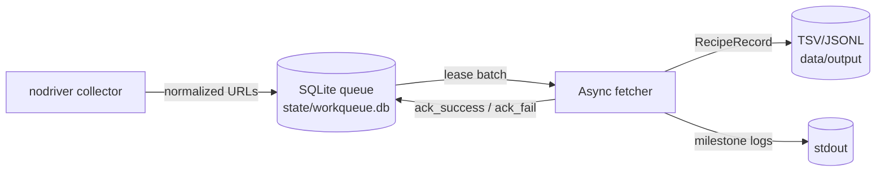

## Project Overview

This crawler exports recipes from 1000.menu in two independent stages that share a single SQLite queue:

- **Link Collector** (`src/workers/link_collector.py`): Playwright drives headless Chromium, keeps clicking *“Показать ещё результаты…”*, normalizes every recipe `<a>` it sees, and stores unique URLs in the queue.
- **Recipe Fetcher** (`src/workers/recipe_fetcher.py`): an async `httpx` worker that leases URLs in batches, downloads each page, parses it into `RecipeRecord`, and writes TSV/JSONL rows. Successful URLs are marked `processed`; failures retry up to the configured limit.

Durability comes from the `state-data` volume (queue DB + collector checkpoint), while TSV/JSONL outputs are bind-mounted via `data/`.



### Key Logic

1. **Uniqueness:** The queue table uses `url TEXT PRIMARY KEY`; `add_links()` inserts only unseen URLs, so every recipe is fetched at most once unless you manually reset its status.
2. **Resilience:** `CollectorState` stores the number of “load more” clicks completed, letting browser restarts resume pagination without missing pages.
3. **Parser:** `parse_recipe()` prefers schema.org fields but falls back to `#pt_info` and splits `<br>`-based instructions, so it works across old and new layouts.
4. **Throughput controls:** `CollectorSettings` (click delays, scroll pauses) guard against bans; `FetcherSettings` (batch size, HTTP concurrency, progress interval) tune how aggressively we drain the queue.

### Benchmarking Delays

Use the helper script `scripts/benchmark_delays.py` to sweep different `click_delay` / `scroll_pause` pairs without touching your persistent state:

```bash
python scripts/benchmark_delays.py \
  --click-delays "0.05,0.1,0.2" \
  --scroll-pauses "0.02,0.05" \
  --max-clicks 5
```

Each combination runs the nodriver collector for `max_clicks` load-more events inside an ephemeral state directory and prints how many unique links were captured plus the links-per-second rate. Use the best-performing tuple as your production default (via CLI flags or environment variables), then delete the script if it’s no longer needed.

### Future Ideas

- Add a lightweight monitoring endpoint (e.g., FastAPI) that reports queue stats and processed counts.
- Support an HTTP-only collector mode that mimics the AJAX pagination endpoint for environments where headless Chromium is unavailable.
- Emit structured metrics (Prometheus or JSON) so CI can fail early if parsing success drops below a threshold.


